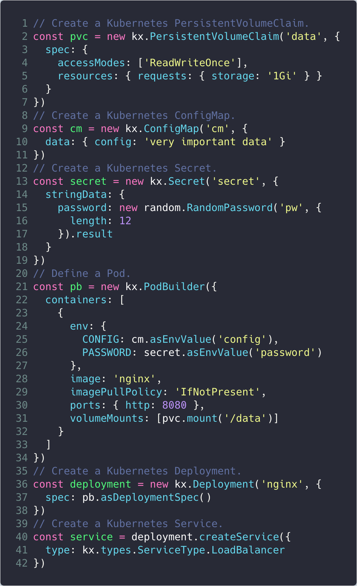
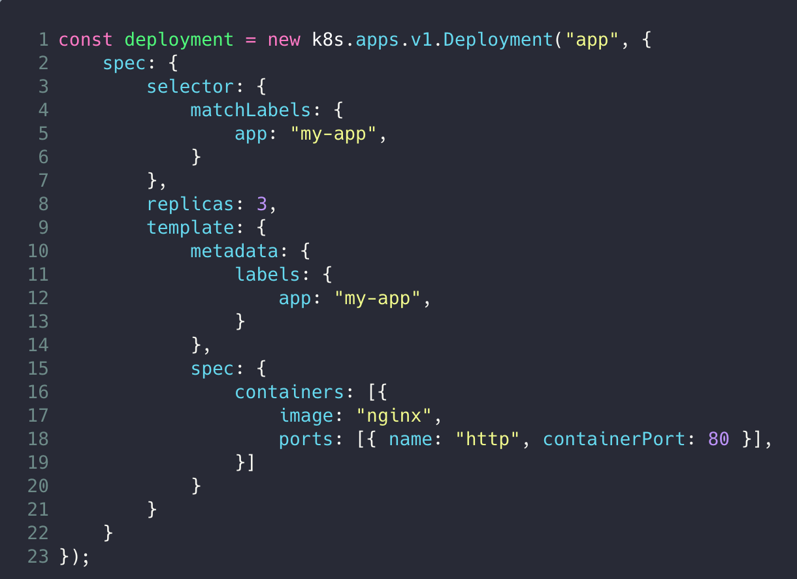
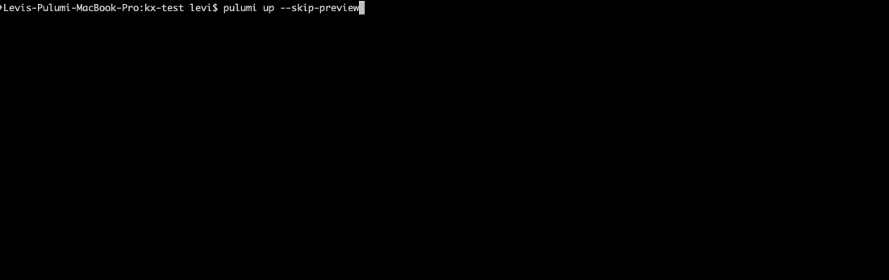

# Pulumi Kubernetes Extensions

_Kubernetes for Humans_

The Kubernetes API includes many required fields that aren't interesting to the
humans using the API. While these fields are necessary for Kubernetes, the machine,
they are a distraction for users.

The Kubernetes Extensions (`kx`) library for Pulumi is designed to simplify the 
declaration of Kubernetes resources, and make the API easier for humans to use. 
This is accomplished in the following ways:

1. **Better Syntax** - Where possible, we simplify the resource syntax. The kx
   library maintains full compatibility with the raw k8s declarations, so it
   is possible to mix and match with resources defined with `pulumi-kubernetes`.
1. **Easily compose resources** - Kubernetes apps usually comprise several resources
   that reference each other (Deployment, ConfigMap, Secret, etc.). `kx` makes it
   easy to inject these references without having to worry about managing
   labels/selectors or resource names.
1. **Idiomatic Kubernetes** - We don't reinvent the wheel; the syntax is a
   streamlined version of the same Kubernetes API you are used to. These extensions
   are designed to accomodate production use cases, and provide access the full API
   surface.
   
The `kx` library takes full advantage of being defined in TypeScript, not in YAML.
This enables the use of functions, overloading, type-checking, and many other 
richer API design tools than are available using YAML or Helm.

If you are just getting started with Pulumi and Kubernetes, the 
[Pulumi Kubernetes](https://www.pulumi.com/docs/intro/cloud-providers/kubernetes/)
introduction is a good place to start.

| kx                                     | raw provider                                      |
| :------------------------------------: | :-----------------------------------------------: |
|  |  |



## Installation

This package is available in JavaScript/TypeScript for use with Node.js.  Install it using either `npm`:

    $ npm install @pulumi/kubernetesx

or `yarn`:

    $ yarn add @pulumi/kubernetesx

## Usage Examples

### Define a Pod

Use the `PodBuilder` class to define a PodSpec that can be used by other kx classes
that include a PodSpec (Pod, Deployment, StatefulSet, DaemonSet, ReplicaSet).

```typescript
const pb = new kx.PodBuilder({
    containers: [{
        // name is not required. If not provided, it is inferred from the image.
        image: "nginx",
        ports: {http: 80}, // Simplified ports syntax.
    }]
});
```

Note that a `PodBuilder` does not create a k8s resource; it is a convenience class
for defining a PodSpec that can be easily composed with other kx resources.

```typescript
// Define the PodSpec.
const pb = new kx.PodBuilder({
    containers: [{image: "nginx"}]
});
// Create a Pod resource using the PodBuilder.
new kx.Pod("nginx", {
    spec: pb
});
```

### Create a Deployment

Using a `PodBuilder` class to define the workload Pod, create a Deployment
resource. Instantiating the `kx.Deployment` class will cause Pulumi to create
a matching `Deployment` resource in your Kubernetes cluster on the next `pulumi up`.

```typescript
const pb = new kx.PodBuilder(...);
const deployment = new kx.Deployment("app", {
    // asDeploymentSpec() takes parameters corresponding 
    // to a DeploymentSpec (e.g., replicas).
    spec: pb.asDeploymentSpec({ replicas: 3 }) 
});
```

Note that you can still define the DeploymentSpec explicitly, but would be
responsible for defining required fields (labels/selectors, etc.) as usual.
This still benefits from the enhanced kx syntax for `env`, `ports`, 
`volumeMounts`, and resource composability.

```typescript
const deployment = new kx.Deployment("app", {
    spec: {
        selector: {
            matchLabels: {
                app: "my-app",
            }
        },
        replicas: 3,
        template: {
            metadata: {
                labels: {
                    app: "my-app",
                }
            },
            spec: {
                containers: [{
                    image: "nginx",
                    ports: {http: 80},
                }]
            }
        }
    }
});
```

### Create a ClusterIP Service from the Deployment

Easily create a Service from a workload using the `createService` verb.

```typescript
const deployment = new kx.Deployment(...);
const service = deployment.createService();
```

### Add a PersistentVolumeClaim to a Pod

Use the `mount` verb on a PersistentVolumeClaim to add it to a Pod under the
`volumeMounts` field. The `PodBuilder` automatically creates the corresponding
`volume` and naming boilerplate.

```typescript
const pvc = new kx.PersistentVolumeClaim("data", {
    spec: {
        accessModes: [ "ReadWriteOnce" ],
        resources: { requests: { storage: "1Gi" } }
    }
});
const pb = new kx.PodBuilder({
    containers: [{
        image: "nginx",
        ports: {http: 80},
        volumeMounts: [ pvc.mount("/data") ],
    }]
});
```

### Create Environment Variables from a ConfigMap and Secret

Use the `asEnvValue` verb on ConfigMap and Secret resources to add them to the Pod
under the `env` field. The `PodBuilder` automatically creates the relevant boilerplate
depending on the resource type.

```typescript
const cm = new kx.ConfigMap("cm", {
    data: { "config": "very important data" }
});
const secret = new kx.Secret("secret", {
    stringData: { "password": new random.RandomPassword("password", { length: 12 }).result }
});
const pb = new kx.PodBuilder({
    containers: [{
        env: {
            DATA: cm.asEnvValue("config"),
            PASSWORD: secret.asEnvValue("password"),
        },
        image: "nginx",
        ports: {http: 80},
    }]
});
```

## Learn more about Pulumi

[Intro to Pulumi](https://www.pulumi.com/docs/intro/)

[Get Started with Kubernetes](https://www.pulumi.com/docs/get-started/kubernetes/)

[Kubernetes Tutorials](https://www.pulumi.com/docs/tutorials/kubernetes/)

[Pulumi: A Better Way to Kubernetes](https://www.pulumi.com/blog/pulumi-a-better-way-to-kubernetes/)

[Pulumi's YouTube Channel](https://www.youtube.com/channel/UC2Dhyn4Ev52YSbcpfnfP0Mw)
